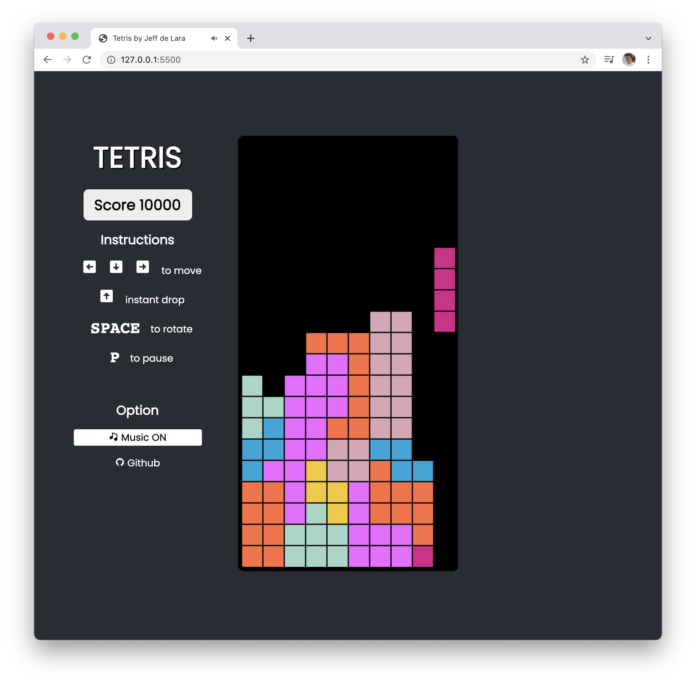

# Tetris

Tetris game recreated with HTML/CSS and Javascript. 

## Game loop & Rendering

For the game loop with `requestAnimationFrame`, its also using the HTML Canvas API for game graphics and animation.

## Code Structure

The code for Tetris is organized by using Javascript classes, where each piece has its own class and its own methods defined (e.g. rotate). All other game objects like the player has its own class as well. 

## Demo
Visit this link to play the game.
[Live demo](https://tetris-jeffdelara.netlify.app/)
